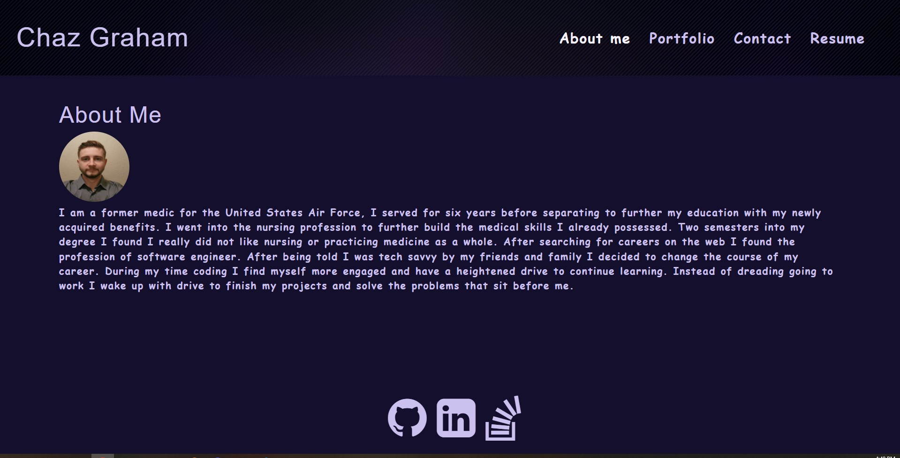

# Chazs React Portfolio

## Descripton
A single-page application that uses conditional rendering via react `useState` to render the pages information. 
http://chazgraham.github.io/Chazs-React-Portfolio

## Table of Contents
  * [Installation Instructions](#installation-instructions)
  * [Application Usage](#application-usage)
  * [Contributors](#contributors)
  * [Licenses](#licenses)
  * [Tests](#tests)
  * [Contact Me](#contact-me)

## Installation Instructions
Before running this application you must install -please `npm i`, then run `npm start` to run the application locally.

## Application Usage
-The usage is provide potential employers with information about myself and shows off my past projects.

## Contributors
By Chaz Graham

## Licenses
This application is licensed under: None

## Tests
To test application open the console and run the following comand: none

## Contact Me
If you have additional questions you can contact me at https://github.com/chazgraham